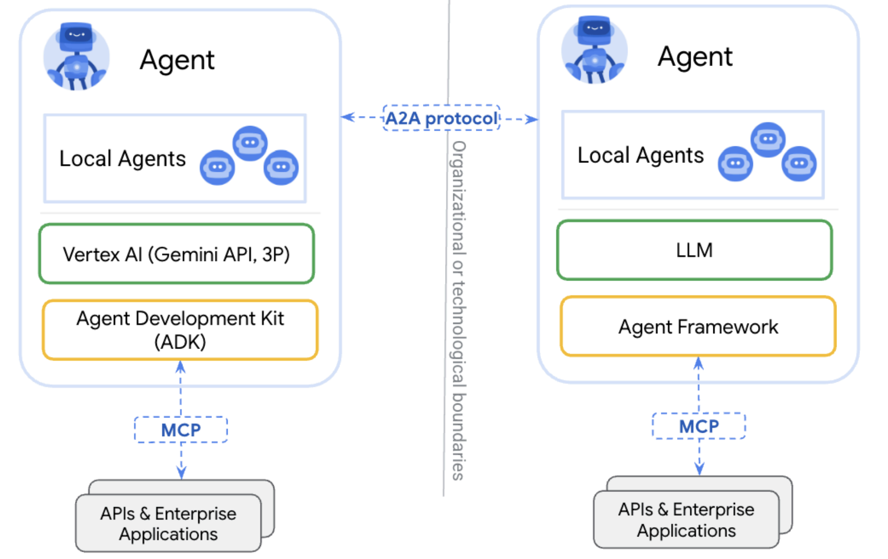
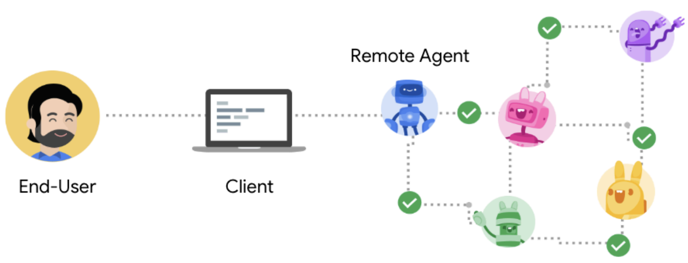
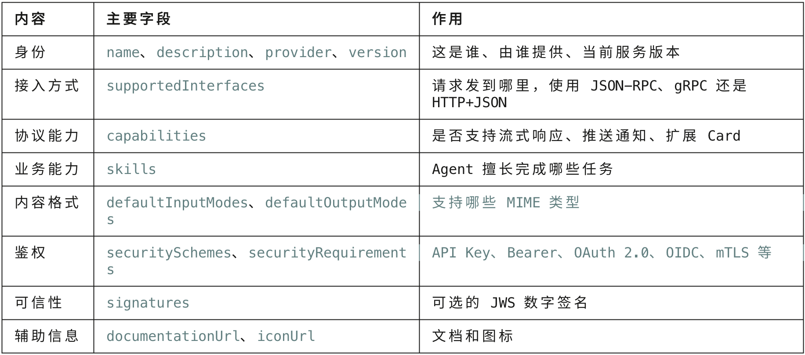
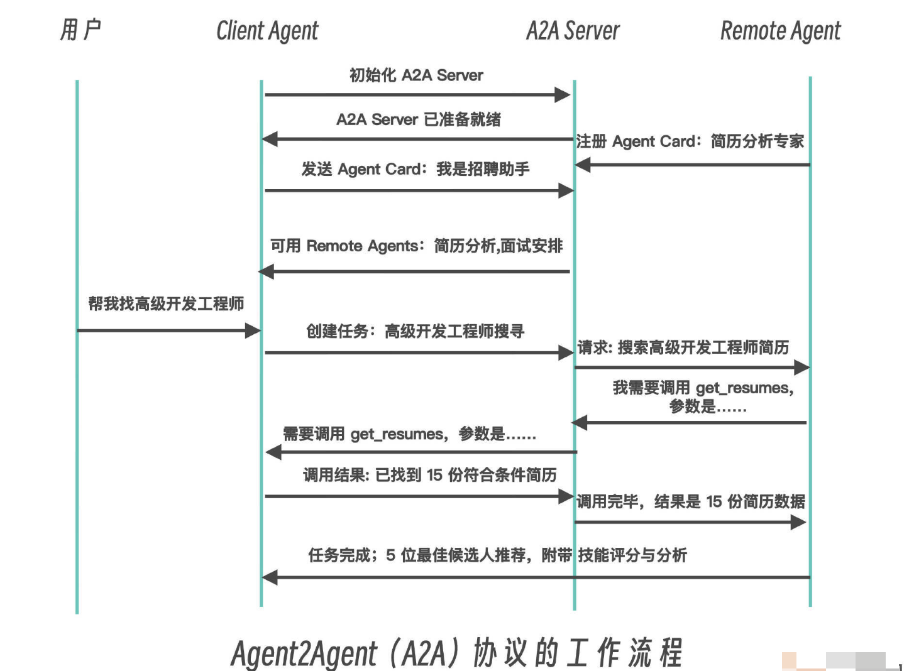

# MCP & A2A 协议


## MCP 协议


### 什么是 MCP

MCP（Model Context Protocol，模型上下文协议） 是 Anthropic 在 2024 年 11 月 提出的开放标准，用来统一 AI 应用（LLM Host） 与 外部工具 / 数据源 的连接方式


在没有 MCP 之前，要让大模型拥有各种工具调用能力，绝非易事，每个工具可能使用不同的接入方式，接入代码通常需要逐个编写

 ```text
 天气 → REST API
 数据库 → 自定义 SDK
 文件系统 → 本地函数
 GitHub → GitHub SDK
 ```


而 MCP 将它们统一为标准接口：

 ```text
 tools/list  → 查询服务器提供了哪些工具
 tools/call  → 调用指定工具
 ```


目前大模型应用开发常见的是：Agent 与 RAG


有了 MCP 协议，无论是 RAG，还是 Agent+Tool Calls（或称 Function Calling），都将得益于 MCP 提供的工具发现和主动调用能力


MCP（模型上下文协议）是一个开放标准，用于将 AI 与外部世界进行连接。可以将 MCP 想象成 AI 应用程序的“USB-C 接 口”。正如 USB-C 为设备提供了连接各种外设的标准方式，MCP 为 AI 模型提供了连接不同数据源和工具的标准方式


### MCP 核心架构

官方采用 `client–host–server` 结构，消息层基于 `JSON-RPC 2.0`，会话是**有状态（stateful）**的

```yaml
┌─────────────────────────────────────────┐
│                 Host                    │
│  （Claude Desktop / IDE / Agent 运行时）  │
│                                         │
│   ┌──────────┐  ┌──────────┐            │
│   │ Client A │  │ Client B │  …         │
│   └────┬─────┘  └────┬─────┘            │
└────────┼─────────────┼──────────────────┘
         │ MCP         │ MCP
         ▼             ▼
   ┌──────────┐  ┌──────────┐
   │ Server 1 │  │ Server 2 │  …（Git、DB、API…）
   └──────────┘  └──────────┘
```

| 角色   | 是什么             | 职责                                                        |
| ------ | ------------------ | ----------------------------------------------------------- |
| Host   | 用户面对的 AI 应用 | 管理多个 Client、UI、策略、安全边界、把工具结果塞回模型对话 |
| Client | Host 内部的协议端  | 与某个 Server 建立 1:1 会话，做能力协商、发请求、收通知     |
| Server | 能力提供者         | 暴露 tools / resources / prompts 等，真正去碰外部系统       |


```yaml
Host = AI 应用外壳（对话 UI + 模型 + 权限）
Client = Host 里连某个 Server 的“插头”
Server = 工具箱 / 数据源适配器

Server 主要提供：
  Tools     → 做事
  Resources → 给上下文
  Prompts   → 给标准任务模板

传输常见：
  本地 stdio / 远程 HTTP(+SSE)

协议底座：
  JSON-RPC 2.0 + 有状态会话 + 能力协商
```


### 三大核心原语

即 Server 最常暴露的东西


#### Tools（工具： “让模型动手”

- 类似 可调用函数 / API
- 由模型在推理中选择调用（模型可控，但 Host 可拦截）
- 有名字、描述、参数 schema（通常 JSON Schema）
- 返回文本或结构化结果

**直觉**：Tools ≈ 函数调用 / Function Calling 的标准化外置版


#### Resources（资源）： “让模型看见数据”

- 类似 可读的上下文数据
- 用 URI 标识（如 `file:///...`、`db://customers/42`、`git://repo/main/README.md`）
- 更偏 应用/用户可控地注入上下文，不一定每一步都由模型“点名调用”
- 可订阅变更（部分实现支持 list/read/subscribe）

**直觉**：Resources ≈ 标准化的“上下文供给”，接近 GET 可读数据，而不是副作用动作


#### Prompts（提示模板）： “把最佳实践固化下来”

- Server 提供的 可复用 prompt 模板
- 可带参数
- 通常由 用户在 UI 中主动选择（user-controlled）
- 可组合 resources / 多步工作流说明

**直觉**：Prompts ≈ 可发现、可参数化的“专家工作流入口”


### MCP 使用

MCP 执行要求：

- 环境：必须是一个支持 MCP 协议的 MCP Client。比如：claude code、codex、cursor 等
- LLM 大模型：需要有一个可的用 AI 模型


市面上有无数的 MCP 开箱即用，也有很多 MCP 市场，

国内的比如：

- [MCP World](https://www.mcpworld.com/)：百度旗下 MCP 市场
- [modelscope](https://www.modelscope.cn/mcp)：魔搭社区 MCP 市场

海外的比如：

- [mcp.so](https://mcp.so/zh)
- [smithery](https://smithery.ai/)


使用 MCP 很简单，这里以 claude code 为例，使用 12306 这个 mcp

首先，通过文件的方式，添加 mcp：

> 全局： ~/.claude.json
>
> 项目： .mcp.json

```json
{
  "mcpServers": {
    "tavily": {
      "command": "mcpsnoop",
      "args": [
        "--",
        "npx",
        "-y",
        "tavily-mcp@latest"
      ],
      "env": {
        "TAVILY_API_KEY": "tvly-dev-xxx"
      }
    },
  }
}
```

TAVILY_API_KEY 是 key，需要去官方 tavily 申请一下


## A2A 协议


A2A（Agent2Agent Protocol） 是 Google 在 2025 年 4 月 发布的开放协议，后贡献给 Linux Foundation，目标是让 不同厂商、不同框架、不同组织 构建的 AI Agent 能互相发现、认证、协作、完成任务


A2A **解决 Agent ↔ Agent 互操作；它补充 Anthropic 的 MCP （Agent ↔ Tools/Data），而不是替代它**


### A2A 与 MCP

A2A 与 MCP 各有专长，**A2A 是对 MCP 的补充，不是替代**，再加上 LLM，它们共同构成了一个完整的智能代理生态系统：



- 左侧的 Agent 使用“Vertex AI（Gemini API，3P）”作为其 LLM 层；而右侧 Agent 的 “LLM” 表示可以使用任何大型语言模型。左侧的 “Agent Development Kit（ADK）” （代理开发工具包）和右侧的 “Agent Framework”（代理框架）也不同，意味着基于 LangGraph 框架和基于 AutoGen 或者 CrewAI 等框架开发的 Agent 之间可以互通。

- 两侧的 Agent 都通过 MCP（模型上下文协议）连接到 “APIs & Enterprise Applications” （API 和企业应用）。因此，可以说两个 Agent 系统通过 A2A 协议横向通信；每个系统都通 过 MCP 协议与外部工具和 API 纵向连接


**总结**：

- A2A 标准化「多个 Agent 之间」如何发现、认证、协作
- MCP 标准化「大模型/应用」如何连接外部世界


### A2A 的 5 大核心设计原则

1. **第一是拥抱 Agent 能力**：A2A 不仅仅是将远端 Agent 视为工具调用，而是允许 Agent 以自 由、非结构化的方式交换消息，支持跨内存、跨上下文的真实协作。与此同时，Agent 无需 共享内部思考、计划或工具，因此 **Agent 相互之间成为黑盒**，无需向对方暴露任何不想暴露 的隐私

2. **第二是基于现有标准**：在 HTTP、Server-Sent Events、JSON-RPC 等成熟技术之上构建，确保与现有 IT 架构无缝集成

3. **第三是企业级安全**：A2A 内置与 OpenAPI 同级别的认证与授权机制，满足企业级安全与合规需求

4. **第四是长任务支持**：除了即时调用，还可管理需人机环节介入、耗时数小时甚至数天的深度研 究任务，并实时反馈状态与结果

5.**第五是多模态无差别**：不仅限于文本，还原生支持音频、视频、富表单、嵌入式 iframe 等多种交互形式


### A2A 协议的角色

A2A 协议定义了三个角色，看它们如何各司其职、协同配合，共同支撑多 Agent 生态的运行：

- 用户（User）：最终用户（人类或服务），使用 Agent 系统完成任务。

- 客户端（Client）：代表用户向远程 Agent 请求行动的实体

- 远程 Agent（Remote Agent）：作为 A2A 服务器的“黑盒”Agent




```yaml
   用户 / 上层编排
        │
        ▼
┌──────────────────┐         A2A          ┌──────────────────┐
│  Client Agent    │  ─────────────────►  │  Remote Agent    │
│  （发起方）        │  ◄─────────────────  │ （执行方/服务方）   │
│  发现、委派、跟踪   │                      │  执行技能、回传     │
└──────────────────┘                      └──────────────────┘
```

| 角色                       | 职责                                                         |
| -------------------------- | ------------------------------------------------------------ |
| A2A Client（Client Agent） | 发现合适 Agent、认证、发起任务/消息、跟踪状态、收集产物      |
| A2A Server（Remote Agent） | 发布 Agent Card、接收任务、执行技能、更新状态、返回 Artifacts |


### A2A 协议的核心对象

A2A 协议设计了一套完整的对象体系，包括 `Agent Card、Task、Message、Part 和 Artifact`。它们用于实现不同 Agent 之间的高效协作，这些核心对象相互配合，共同构成了 A2A 的通信框架


#### Agent Card（Agent 名片）

每个支持 A2A 的远程 Agent 需要发布一个 JSON 格式的 “Agent Card”，描述该 Agent 的能力和认证机制。使得 Client 可以在不了解 Agent 内部实现、模型、Prompt 或工具链的情况下，仍然能够发现这个 Agent、判断它是否适合某项任务，并正确连接它通过这些信息选择最适合的 Agent 来完成任务


**Agent Card = 身份说明 + 能力目录 + 接入地址 + 协议能力 + 鉴权要求**，用来描述：我是谁、我能做什么、怎么连我、要什么鉴权、支持哪些输入输出模态


一个典型的 Agent Card 结构：

```json
{
 "name": "Code Review Agent",
 "description": "Reviews source code for correctness and security risks.",
 "version": "2.1.0",

 "supportedInterfaces": [
   {
     "url": "https://agents.example.com/code-review/a2a",
     "protocolBinding": "JSONRPC",
     "protocolVersion": "1.0"
   },
   {
     "url": "https://agents.example.com/code-review/api",
     "protocolBinding": "HTTP+JSON",
     "protocolVersion": "1.0"
   }
 ],

 "capabilities": {
   "streaming": true,
   "pushNotifications": false,
   "extendedAgentCard": true
 },

 "defaultInputModes": [
   "text/plain",
   "application/json"
 ],

 "defaultOutputModes": [
   "text/plain",
   "application/json"
 ],

 "skills": [
   {
     "id": "security-review",
     "name": "Security Review",
     "description": "Finds security vulnerabilities in source code.",
     "tags": ["security", "code-review", "static-analysis"],
     "examples": [
       "Review this authentication handler.",
       "Find injection vulnerabilities in this SQL layer."
     ],
     "inputModes": ["text/plain", "application/json"],
     "outputModes": ["application/json"]
   }
 ]
}
```




#### Task（任务）

Task 是 Client 和 Remote Agent 之间协作的核心概念。一个 Task 代表一个需要完成的任务，包含状态、历史记录和结果


当 Client 发来的请求需要持续推进时，Server 会把它纳入一个 Task：

- Task 是有生命周期的状态机
- 可以秒级完成，也可以跑几分钟、几小时
- 过程中可更新状态、产出中间结果
- 最终进入终态：完成 / 失败 / 取消 等


常见能力：

- 创建/推进任务
- `tasks/get` 查询
- `tasks/cancel` 取消
- 推送通知配置（若双方支持）


Task 的具体状态列表如下：

- **TASK_STATE_UNSPECIFIED**：未知或无法确定（异常/缺省）
- **TASK_STATE_SUBMITTED**：已接收并确认（处理中）
- **TASK_STATE_WORKING**：正在执行（处理中）
- **TASK_STATE_INPUT_REQUIRED**：需要客户端补充输入（中断态）
- **TASK_STATE_AUTH_REQUIRED**：需要授权或审批（中断态）
- **TASK_STATE_COMPLETED**：成功完成（终态）
- **TASK_STATE_FAILED**：执行失败（终态）
- **TASK_STATE_CANCELED**：已取消（终态）
- **TASK_STATE_REJECTED**：Agent 决定不执行（终态）


#### Message（消息）

Message 用于 Client 和 Remote Agent 之间的通信，可以包含指令、状态更新等内容。一个 Message 可以包含多个 parts，用于传递不同类型的内容


Agent 之间交换的对话/协作内容：

- 用户意图转发
- 澄清问题
- 中间说明
- 指令与上下文

消息通常由多个 **Part** 组成


#### Part（内容分片）

消息/产物里的最小内容单元，常见类型：

| 类型     | 用途                         |
| -------- | ---------------------------- |
| TextPart | 自然语言文本                 |
| FilePart | 文件（路径/字节/URI 等形态） |
| DataPart | 结构化 JSON 数据             |


#### Artifact（产物 / 交付物）

Artifact 是 Remote Agent 生成的任务结果。Artifact 可以有多个部分（parts），可以是文本、图像等


Task 的输出成果，例如：

- 生成的报告 PDF
- 结构化采购单 JSON
- 分析结论文本
- 中间版本的草稿


#### 五者关系

关系可以记成：

```yaml
Agent Card    → 我能做什么
Message/Part  → 我们怎么谈
Task          → 正在办的事
Artifact      → 最终/阶段性交付物
```


### A2A 协议工作流程

A2A 协议的典型工作流程如下：

1. **能力发现**：每个 Agent 通过一个 JSON 格式的 “Agent Card” 公布自己能执行的能力 （如检索文档、调度会议等）
2. **任务管理**：Agent 间围绕一个 “task” 对象展开协作。该对象有生命周期、状态更新和最 终产物（artifact），支持即时完成与长跑任务两种模式
3. **消息协作**：双方可互发消息，携带上下文、用户指令或中间产物；消息中包含若干 “parts”，每个 part 都指明内容类型，便于双方就 UI 呈现形式（如图片、表单、视频） 进行协商
4. **状态同步**：通过 SSE 等机制，Client Agent 与 Remote Agent 保持实时状态同步，确保 用户看到最新的进度和结果


一个 A2A 协议的基本请求-响应流程：

**Client发送任务**

```json
{
  "jsonrpc": "2.0",
  "id": 1,
  "method": "tasks/send",
  "params": {
    "id": "de38c76d-d54c-436c-8b9f-4c2703648d64",
    "message": {
      "role": "user",
      "parts": [
        {
          "type": "text",
          "text": "请分析下面5位候选人是否符合岗位需求，并推荐最佳人选。"
        }
      ]
    },
    "metadata": {}
  }
}
```


**Remote Agent响应**

```json
{
  "jsonrpc": "2.0",
  "id": 1,
  "result": {
    "id": "de38c76d-d54c-436c-8b9f-4c2703648d64",
    "sessionId": "c295ea44-7543-4f78-b524-7a38915ad6e4",
    "status": {
      "state": "completed"
    },
    "artifacts": [
      {
        "name": "result",
        "parts": [
          {
            "type": "text",
            "text": "第二位候选人最符合你的需求!"
          }
        ]
      }
    ],
    "metadata": {}
  }
}
```


以“招聘候选人搜寻”这个应用场景为例：

- 用户在统一界面下向自己的 Agent 发起“寻找 XX 岗位候选人”请求。
- Client Agent 根据岗位需求调用简历检索 Agent、技能筛选 Agent 等多个 Remote Agent。
- 各 Agent 协同返回候选人名单（artifact），并由 Client Agent 汇总、展示。
- 后续可继续调用“面试安排 Agent”“背景调查 Agent”，形成端到端招聘流程自动化




### A2A 核心总结

```yaml
A2A = 跨 Agent 的任务协作协议

发现：   Agent Card（我是谁、我会什么、怎么连）
执行：   Task（有生命周期的工作单）
交流：   Message + Part（文本/文件/结构化数据）
交付：   Artifact（结果产物）
通道：   HTTP(S) + JSON-RPC（常见），可流式/可推送
安全：   OpenAPI 风格鉴权 + 企业策略
关系：   互补 MCP

         MCP 给工具，A2A 连同伴
```


