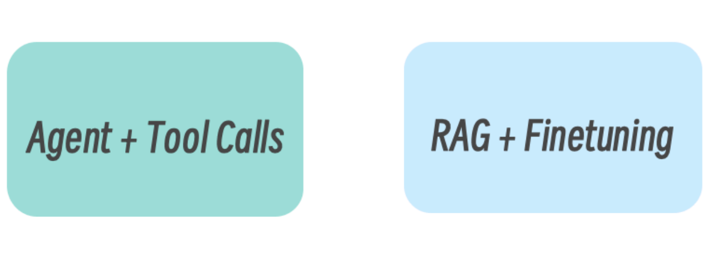

# MCP & A2A 协议


## MCP 协议


### 什么是 MCP

目前大模型应用开发常见的是：Agent 与 RAG



在没有 MCP 之前，要让大模型拥有各种工具调用能力，绝非易事，每个工具可能使用不同的接入方式，接入代码通常需要逐个编写

 ```text
 天气 → REST API
 数据库 → 自定义 SDK
 文件系统 → 本地函数
 GitHub → GitHub SDK
 ```


而 MCP 将它们统一为标准接口：

 ```text
 tools/list  → 查询服务器提供了哪些工具
 tools/call  → 调用指定工具
 ```

有了 MCP 协议，无论是 RAG，还是 Agent+Tool Calls（或称 Function Calling），都将得益于 MCP 提供的工具发现和主动调用能力


MCP（模型上下文协议）是一个开放标准，用于将 AI 与外部世界进行连接。可以将 MCP 想象成 AI 应用程序的“USB-C 接 口”。正如 USB-C 为设备提供了连接各种外设的标准方式，MCP 为 AI 模型提供了连接不同数据源和工具的标准方式


### MCP 使用

MCP 执行要求：

- 环境：必须是一个支持 MCP 协议的 MCP Client。比如：claude code、codex、cursor 等
- LLM 大模型：需要有一个可的用 AI 模型


市面上有无数的 MCP 开箱即用，也有很多 MCP 市场，

国内的比如：

- [MCP World](https://www.mcpworld.com/)：百度旗下 MCP 市场
- [modelscope](https://www.modelscope.cn/mcp)：魔搭社区 MCP 市场

海外的比如：

- [mcp.so](https://mcp.so/zh)
- [smithery](https://smithery.ai/)


使用 MCP 很简单，这里以 claude code 为例，使用 12306 这个 mcp

首先，通过文件的方式，添加 mcp：

> 全局： ~/.claude.json
>
> 项目： .mcp.json

```json
{
  "mcpServers": {
    "tavily": {
      "command": "mcpsnoop",
      "args": [
        "--",
        "npx",
        "-y",
        "tavily-mcp@latest"
      ],
      "env": {
        "TAVILY_API_KEY": "tvly-dev-xxx"
      }
    },
  }
}
```

TAVILY_API_KEY 是 key，需要去官方 tavily 申请一下


