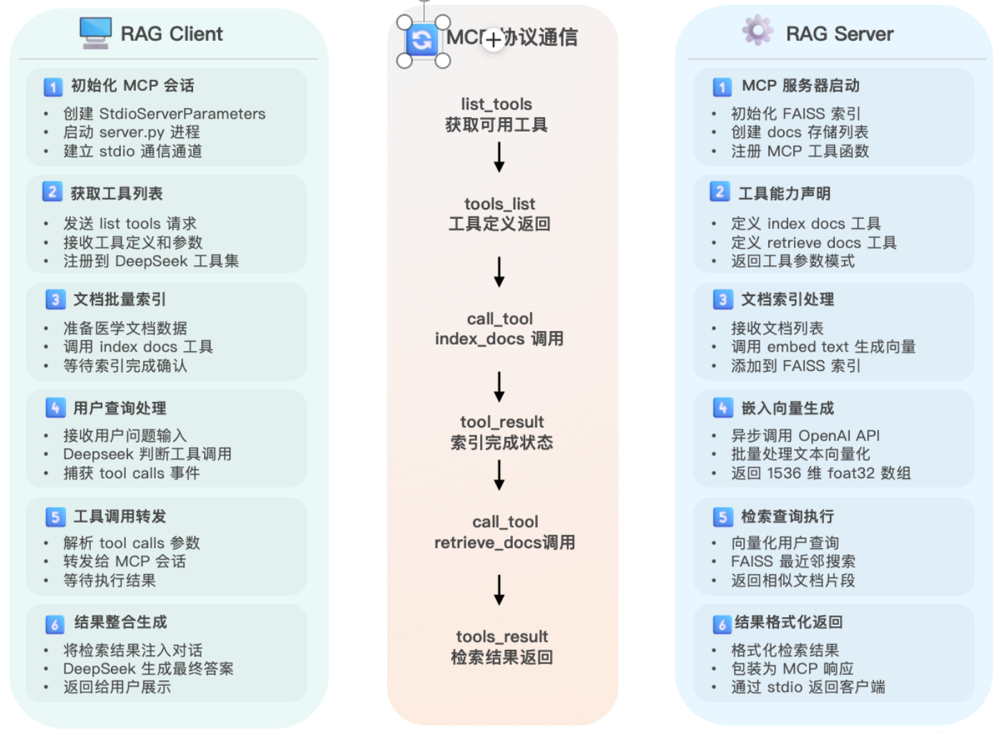
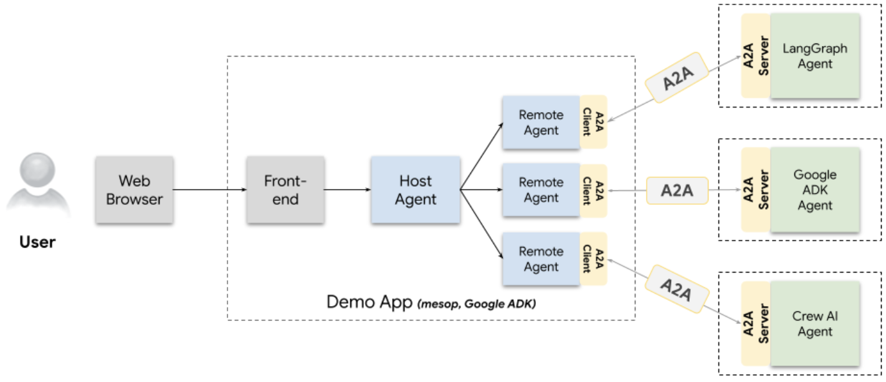
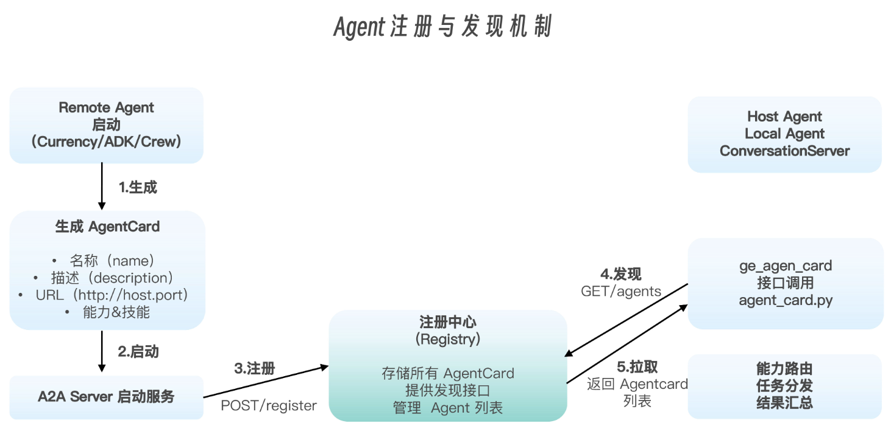

# 协议基础实践

## 基于 MCP 搭建 RAG “医疗健康“指北

### 什么是 RAG

RAG（Retrieval-Augmented Generation，检索增强生成），是一种将检索与生成结合起来的对话或问答技术。

当用户提出问题时，系统先把问题转成向量（Embedding），在事先构建好的向量数据库中检索出与问题最相关的文档片段，再把这些片段连同原始问题一起喂给大模型（LLM）生成回答。这样可以让模型“看到”最新、最准确的外部知识，弥补它自身训练数据的盲区或时效性不足

具体流程可以分为三步：

1. **第一步嵌入（Embedding）**：将用户问题转化为向量

2. **第二步检索（Retrieval）**：在向量索引中找出与这个向量最相近的若干文档块

3. **第三步生成（Generation）**：把检索到的文档片段和问题一起作为提示，交给大模型输出最终答案

通过这种“先检索再生成”的方式，RAG 不仅能提升回答的准确度，还能为每一次生成提供可追溯的知识来源

### 整体思路

嵌入（Embedding）服务和检索（Retrieval）都以工具的形式通过 MCP 协议提供给 Client；而最后的生成仍由 Client 端的大模型来完成，此外，要进行嵌入的文档也由 Client 来提供给 MCP 服务

整体设计思路如下图：

示例代码：

> 01-MCP/02-mcp-rag

## A2A 智能体协作

### A2A 智能体平台

通过 A2A 协议搭建的智能体平台，让智能体不仅能够相互对话，还能够协作协力来完成一个任务

在这个基于 A2A 协议的智能体平台中：

1. 用户在浏览器端发出指令后，前端会将该请求传给 Host Agent，由它负责解析用户意图、拆解具体子任务，并且并行触发多个 Remote Agent
2. 每个 Remote Agent 通过 A2A Client 将子任务封装为标准的 JSON-RPC 请求，发送给远端对应的 A2A Server，再由后者调用各自擅长的智能体模块（如 LangGraph Agent负责外汇兑换、Google ADK Agent负责报销收据、Crew AI Agent负责根据文字内容来生成图片等）执行并返回结果
3. 最后，Host Agent 汇总并格式化各路反馈，一并呈现给用户，实现多智能体的分工协作与能力互补

### 整体设计

从整体架构上看，一个 A2A 系统由以下主要组件构成：

- Agent Card: 代理的身份标识和能力声明。
- Skill: 代理可执行的具体能力。
- Task Manager: 处理任务流和状态管理。
- Server: 提供HTTP接口让其他代理/客户端访问。

而在这些关键组件实现的基础之上，还需要为 A2A 应用创建 UI，并注册服务，还要通过一系列的通信机制让外部 Agent 和 Host Agent（本地 Agent）能够相互对话，进行能力的发现

Agent 的注册与发现：

- 每个 Agent 启动时会生成自己的 AgentCard，内含名称、描述、服务 URL 以及所支持的能力和技能等关键信息
- 启动后，Agent 通过 A2A Server 将自己的 AgentCard 向注册中心登记，而 Host 端则通过注册/发现机制（如调用 demo/ui/utils/agent_card.py 中的 get_agent_card 接口）远程拉取所有 AgentCard，实现能力路由与展示，从而完成代理之间的能力发现与互操作

 
