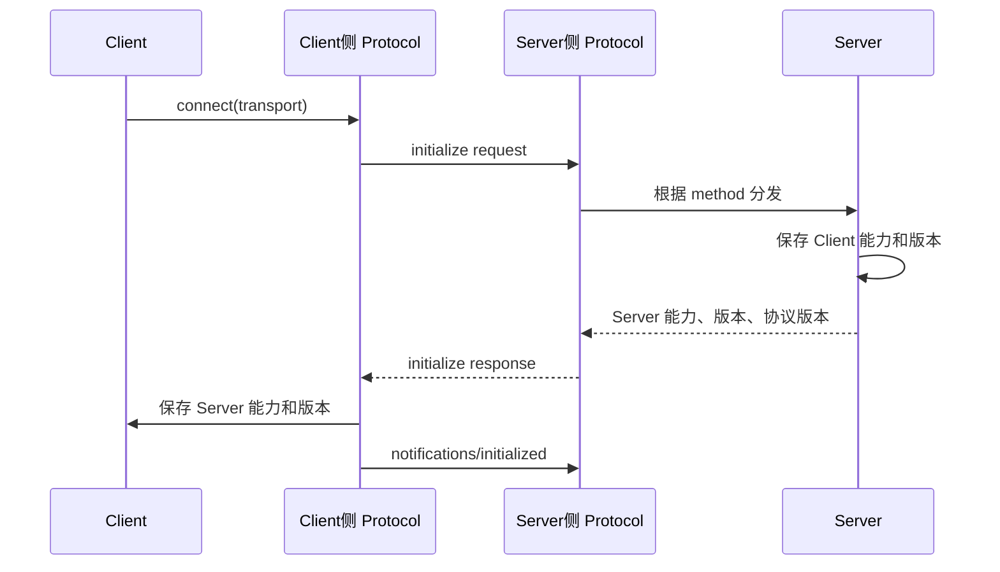
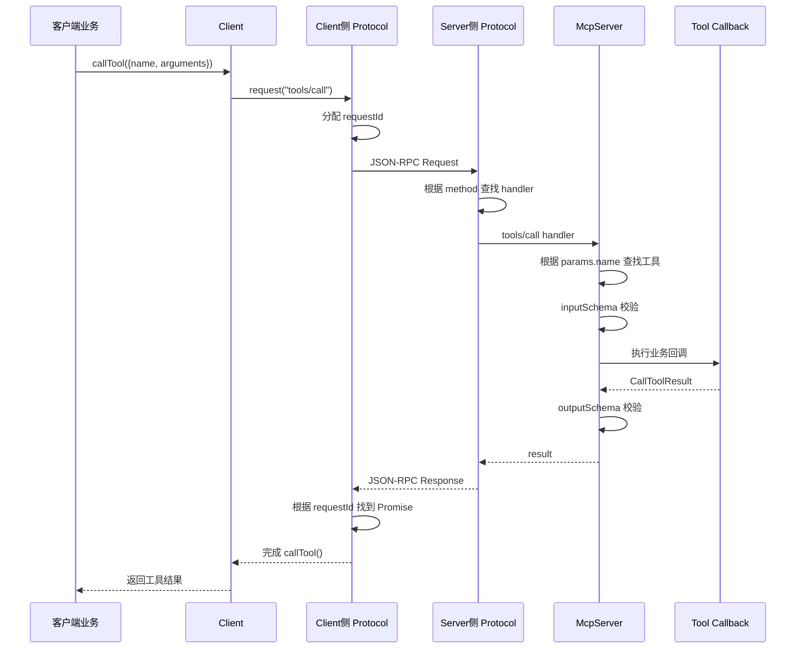

# MCP 深入

> 当前还是基于 mcp typescript sdk 1.x 版本，mcp typescript sdk 2.x 版本已经完全重构，有不少不同的地方


## MCP 协议层

在传统的大模型应用中，模型本身只能被动地接收输入、产生输出，要让它调用外部工具或访问自定义的上下文，就需要在代码里逐条写好 API 调用、认证、错误处理的逻辑，既繁琐又难以维护

MCP（Model Context Protocol）的初衷，就是将这些“上下文管理”和“工具调用”能力**抽象成一个标准化的通信协议**，让大模型应用只需关注“我想用什么资源”，由专门的 MCP 服务端来真正执行调用、管理状态、返回结果


### MCP架构中的Host、Client和Server

MCP 官方采用 `client–host–server` 结构：

  - Host（宿主）：承载 LLM、管理 Client 实例的应用主体（如 Claude Desktop、IDE 插件）。它负责连接生命周期、权限控制、用户确认
  - Client（客户端）：Host 内部为每个 Server 维护的「1:1连接实体」，负责协议握手、消息路由、能力协商。一个 Client 只连接一个 Server。
  - Server（服务端）：对外暴露能力（tools / resources / prompts 等）的独立进程或服务

```yaml
[ 用户 / AI 模型 ]
       │
   ┌───▼───────────────────────────────────┐
   │             MCP Host              │ (例如: Claude Desktop)
   │                                       │
   │  ┌──────────────┐   ┌──────────────┐  │
   │  │   Client A   │   │   Client B   │  │ (Host 内部的多个客户端实例)
   └──┴──────┬───────┴───┴──────┬───────┴──┘
             │ (1:1 stdio/SSE)  │ (1:1 stdio/SSE)
   ┌─────────▼───────┐   ┌──────▼──────────┐
   │ GitHub Server   │   │ Postgres Server │ (独立的外部服务进程)
   └─────────────────┘   └─────────────────┘
```


整个交互流程可以分为三个阶段：

1. **握手初始化**：Host 的 MCP Client 向 Server 发起 initialize 请求，双方交换协议版本与能力列表，并用 initialized 通知确认

2. **正常通信**：Client/Server 可**双向发起** Request–Response（同步调用）或单向 Notification（异步事件），大模型应用只需按需调用 Client 的接口

3. **优雅收尾**：通信完成后，任意一端可调用 close() 或因底层通道断开而触发连接关闭


在上面的 MCP 连接生命周期中，Client 和 Server 之间可以传递下列类型的 MCP 消息类型：

- Request：期待收到响应
- Result：请求成功的响应
- Error：请求失败时返回
- Notification：单向消息，无需响应


### 协议层四大类

- Protocol 类：提供 JSON-RPC 消息收发、请求响应关联、取消、超时和通用消息分发等通用协议能力
- Server 类：继承 `Protocol`，负责服务端的协议初始化、能力管理及请求处理
- McpServer 类：封装底层 `Server`，提供工具、资源和提示词的高级注册 API
- Client 类：继承 `Protocol`，负责客户端的初始化握手、能力协商及请求调用


一句话：协议层由 `Protocol` 提供通用协议机制，`Client` 和 `Server` 实现通信两端，`McpServer` 则对 `Server` 进行高级封装


### Protocol 类

[源码地址](https://github.com/modelcontextprotocol/typescript-sdk/blob/1.30.0/src/shared/protocol.ts#L320)

实现 JSON-RPC 的请求关联、取消、超时和通用消息分发等通用协议能力


#### 注册请求处理器

`setRequestHandler()` 负责把方法名和处理函数保存起来

```typescript
setRequestHandler(requestSchema, handler) {
    const method = getMethodLiteral(requestSchema);
    this.assertRequestHandlerCapability(method);
    this._requestHandlers.set(method, (request, extra) => {
        const parsed = parseWithCompat(requestSchema, request);
        return Promise.resolve(handler(parsed, extra));
    });
}
```

步骤：

```yaml
从 Schema 提取 method
        ↓
检查本地是否声明了对应能力
        ↓
保存到 _requestHandlers
```


#### connect：接管 Transport

`connect()` 负责连接 Transport，并安装消息入口：

```typescript
async connect(transport) {
    if (this._transport) {
        throw new Error(
            'Already connected to a transport. Call close() before connecting to a new transport, or use a separate Protocol instance per connection.');
    }

    this._transport = transport;

    this._transport.onmessage = (message, extra) => {
        if (isJSONRPCResultResponse(message) ||
            isJSONRPCErrorResponse(message)) {
            this._onresponse(message);
        }
        else if (isJSONRPCRequest(message)) {
            this._onrequest(message, extra);
        }
        else if (isJSONRPCNotification(message)) {
            this._onnotification(message);
        }
        else {
            this._onerror(
                new Error(
                    `Unknown message type: ${JSON.stringify(message)}`));
        }
    };

    await this._transport.start();
}
```

消息被分为三类：

```yaml
有 method、有 id
    → Request
    → _onrequest()

有 id、有 result/error
    → Response
    → _onresponse()

有 method、没有 id
    → Notification
    → _onnotification()
```


#### 接收请求：_onrequest()

请求处理器通过 `setRequestHandler()` 注册之后

收到 Request 后，先根据 `method` 查找处理器：

```typescript
const handler =
    this._requestHandlers.get(request.method) ??
    this.fallbackRequestHandler;
```


找到后，执行 handler，并使用原请求 ID 返回结果：

```typescript
.then(() => handler(request, fullExtra))


// 返回结果
const response = {
    result,
    jsonrpc: '2.0',
    id: request.id
};

await capturedTransport?.send(response);
```


因此，请求接收的主流程是：

```yaml
收到 Request
  → 根据 method 找 handler
  → Schema 校验请求
  → 执行 handler
  → 返回相同 id 的 result/error
```


#### 发出请求：request()

`Protocol` 不仅处理请求，也可以主动向对端发送请求

比如：

```typescript
client.listTools()

// 或者
server.createMessage()
```


最终都会调用 `Protocol.request()`，`request()` 会为请求分配 ID

```typescript
request(request, resultSchema, options) {
    return new Promise((resolve, reject) => {
        if (!this._transport) {
            reject(new Error('Not connected'));
            return;
        }

        // 分配 id
        const messageId = this._requestMessageId++;

        const jsonrpcRequest = {
            ...request,
            jsonrpc: '2.0',
            id: messageId
        };
```


然后将这次请求的 Promise 回调保存起来：

```typescript
this._responseHandlers.set(
    messageId,
    response => {
        if (response instanceof Error) {
            return reject(response);
        }

        const parseResult =
            safeParse(resultSchema, response.result);

        if (!parseResult.success) {
            reject(parseResult.error);
        }
        else {
            resolve(parseResult.data);
        }
    });
```


最后发送：

```typescript
this._transport.send(jsonrpcRequest);
```


例如发送 ID 为 `7` 的请求：

```typescript
{
  "jsonrpc": "2.0",
  "id": 7,
  "method": "tools/list"
}
```


#### 接收响应：_onresponse()

收到响应后，根据响应 ID 找到之前保存的回调：

```typescript
_onresponse(response) {
    const messageId = Number(response.id);

    const handler =
        this._responseHandlers.get(messageId);

    if (handler === undefined) {
        this._onerror(
            new Error(
                `Received a response for an unknown message ID: ${JSON.stringify(response)}`));
        return;
    }

    this._responseHandlers.delete(messageId);
    this._cleanupTimeout(messageId);
```


然后根据响应类型调用回调：

```typescript
if (isJSONRPCResultResponse(response)) {
    handler(response);
}
else {
    const error = McpError.fromError(
        response.error.code,
        response.error.message,
        response.error.data);

    handler(error);
}
```


这就完成了请求和响应的关联：

```yaml
request()
  → 分配 id=7
  → 保存 _responseHandlers[7]
  → 发送请求
  → 收到响应 id=7
  → _onresponse()
  → 找到 _responseHandlers[7]
  → 清理超时和 handler
  → 校验 response.result
  → resolve 或 reject 原 Promise
```


#### Notification

Notification 没有 ID，也不等待响应。

发送通知：

```typescript
async notification(notification, options) {
    if (!this._transport) {
        throw new Error('Not connected');
    }

    this.assertNotificationCapability(
        notification.method);

    const jsonrpcNotification = {
        ...notification,
        jsonrpc: '2.0'
    };

    await this._transport.send(
        jsonrpcNotification,
        options);
}
```


接收通知时：

```typescript
const handler =
    this._notificationHandlers.get(
        notification.method) ??
    this.fallbackNotificationHandler;
```

没有 handler 的通知会被忽略，不返回 `MethodNotFound`


#### 关闭连接

`close()` 本身只是关闭 Transport：

```typescript
async close() {
    await this._transport?.close();
}
```

Transport 触发 `onclose` 后，`Protocol._onclose()` 会：

- 清空等待响应的 handler。
- 清理超时器
- 清理进度 handler
- 中止正在处理的请求
- 将未完成请求以 `ConnectionClosed` 结束


#### 总结

下面三个是最重要的：

```yaml
_transport
负责真正收发消息

_requestHandlers
method → 处理接收到的请求

_responseHandlers
requestId → 完成之前发出的请求
```


完整核心流程：

```yaml
收到消息
  → connect() 判断消息类型
  → Request：按 method 找 handler
  → Response：按 id 找 Promise
  → Notification：按 method 找通知 handler

发出请求
  → 分配 id
  → 保存 Promise 回调
  → Transport.send()
  → 收到相同 id 的响应
  → resolve/reject
```


所以 `Protocol` 的本质是：用 `method` 完成请求分发，用 `id` 完成请求与响应的关联，再在外层补充超时、取消、进度和连接生命周期管理


### Server 类

[源码地址](https://github.com/modelcontextprotocol/typescript-sdk/blob/1.30.0/src/server/index.ts#L121)

MCP 底层协议层核心类，继承自 `Protocol`，负责处理 MCP 协议的具体实现（比如：JSON-RPC 消息封装、请求响应关联、通知分发等）


#### Server 类构造函数

先整体看 Server 类：

```typescript
export class Server extends Protocol {
    /**
     * Initializes this server with the given name and version information.
     */
    constructor(_serverInfo, options) {
        super(options);
      
        this._serverInfo = _serverInfo;
        this._capabilities = options?.capabilities ?? {};
        this._instructions = options?.instructions;
        this._jsonSchemaValidator = options?.jsonSchemaValidator ?? new AjvJsonSchemaValidator();

        // ...

        this.setRequestHandler(InitializeRequestSchema, request => this._oninitialize(request));

        this.setNotificationHandler(InitializedNotificationSchema, () => this.oninitialized?.());
        if (this._capabilities.logging) {
            this.setRequestHandler(SetLevelRequestSchema, async (request, extra) => {
                const transportSessionId = extra.sessionId || extra.requestInfo?.headers['mcp-session-id'] || undefined;
                const { level } = request.params;
                const parseResult = LoggingLevelSchema.safeParse(level);
                if (parseResult.success) {
                    this._loggingLevels.set(transportSessionId, parseResult.data);
                }
                return {};
            });
        }
    }
}
```

Server 类构造函数，主要完成四件事：

- 调用 `super(options)` 初始化 `Protocol`

- 保存服务端名称、版本、能力和 instructions

- 注册 `initialize` 请求处理器

- 注册 `notifications/initialized` 通知处理器

```typescript
this.setRequestHandler(
  InitializeRequestSchema,
  request => this._oninitialize(request),
);

this.setNotificationHandler(
  InitializedNotificationSchema,
  () => this.oninitialized?.(),
);
```


#### 初始化握手

真正处理 `initialize` 的逻辑在 `_oninitialize` 函数中：

```typescript
async _oninitialize(request) {
  const requestedVersion = request.params.protocolVersion;

  this._clientCapabilities = request.params.capabilities;
  this._clientVersion = request.params.clientInfo;

  const protocolVersion =
    SUPPORTED_PROTOCOL_VERSIONS.includes(requestedVersion)
      ? requestedVersion
      : LATEST_PROTOCOL_VERSION;

  return {
    protocolVersion,
    capabilities: this.getCapabilities(),
    serverInfo: this._serverInfo,
    ...(this._instructions && { instructions: this._instructions }),
  };
}
```

- 保存客户端能力

- 保存客户端名称和版本

- 协商协议版本

- 返回服务端能力、实现信息和 instructions


> 需要注意的是：`Server.connect()` 本身不发起握手，只负责连接并启动 Transport。握手由客户端 `Client.connect()` 发起


#### 能力管理

`registerCapabilities()`：

```typescript
registerCapabilities(capabilities) {
  if (this.transport) {
    throw new Error(
      "Cannot register capabilities after connecting to transport",
    );
  }

  this._capabilities =
    mergeCapabilities(this._capabilities, capabilities);
}
```


`McpServer` 第一次注册工具时，会自动执行：

```typescript
this.server.registerCapabilities({
  tools: { listChanged: true },
});
```

并安装：

- `tools/list`
- `tools/call`

因此，当第一次调用 `registerTool()` 时，工具能力就已经自动注册好了


#### 请求处理机制

通过 `setRequestHandler` 对请求进行处理


会从 Schema 中取出方法名

```typescript
setRequestHandler(requestSchema, handler) {
  const shape = getObjectShape(requestSchema);
  const methodSchema = shape?.method;
  if (!methodSchema) {
      throw new Error('Schema is missing a method literal');
  }
  const methodValue = getLiteralValue(methodSchema);
  if (typeof methodValue !== 'string') {
      throw new Error('Schema method literal must be a string');
  }
  const method = methodValue;

  // 后续处理
}
```


对 tools/call 特殊处理：

```typescript
if (method === "tools/call") {
  const wrappedHandler =
    async (request, extra) => {
      // 校验请求
      const validatedRequest =
        safeParse(
          CallToolRequestSchema,
          request,
        );

      if (!validatedRequest.success) {
        throw new McpError(
          ErrorCode.InvalidParams,
          "Invalid tools/call request",
        );
      }

      // 执行业务 handler
      const result =
        await Promise.resolve(
          handler(request, extra),
        );

      // 校验处理结果
      const validationResult =
        safeParse(
          CallToolResultSchema,
          result,
        );

      if (!validationResult.success) {
        throw new McpError(
          ErrorCode.InvalidParams,
          "Invalid tools/call result",
        );
      }

      return validationResult.data;
    };

  return super.setRequestHandler(
    requestSchema,
    wrappedHandler,
  );
}
```

处理流程就是：

```yaml
收到 tools/call
      ↓
校验请求格式
      ↓
执行注册的 handler
      ↓
校验返回值格式
      ↓
返回结果
```


其他请求没有特殊包装：走父类 Protocol 的 setRequestHandler 方法

```typescript
return super.setRequestHandler(requestSchema, handler);
```


注册请求处理器时，`Server` 会检查自己是否声明了对应能力：

```typescript
assertRequestHandlerCapability(method) {
  switch (method) {
    case "tools/call":
    case "tools/list":
      if (!this._capabilities.tools) {
        throw new Error(
          `Server does not support tools`,
        );
      }
      break;

    case "resources/list":
    case "resources/read":
      if (!this._capabilities.resources) {
        throw new Error(
          `Server does not support resources`,
        );
      }
      break;

    case "prompts/get":
    case "prompts/list":
      if (!this._capabilities.prompts) {
        throw new Error(
          `Server does not support prompts`,
        );
      }
      break;
  }
}
```


总结：`Server` 通过 `setRequestHandler()` 注册请求处理函数，对 `tools/call` 额外校验请求和返回值，并通过 capabilities 保证 Server 只处理自己声明支持的请求


### McpServer 类

[源码地址](https://github.com/modelcontextprotocol/typescript-sdk/blob/1.30.0/src/server/mcp.ts#L72)

对 Server 的进一步封装，提供高级 API (`registerTool`, `registerResource`, `registerPrompt`等)，自动处理协议协商和能力注册，管理所有注册的功能组件


```yaml
McpServer：管理 Tool、Resource、Prompt
    ↓
Server：处理 MCP 初始化和能力
    ↓
Protocol：处理 JSON-RPC 消息
```


#### 构造函数

```typescript
constructor(serverInfo, options) {
    this._registeredResources = {};
    this._registeredResourceTemplates = {};
    this._registeredTools = {};
    this._registeredPrompts = {};

    this.server = new Server(serverInfo, options);
}
```

这里建立了四个注册表，并创建底层 `Server`


#### 注册模式

`McpServer` 注册 Tool、Resource、Prompt 时，基本都采用相同流程：

```yaml
registerX()
    ↓
保存到 _registeredX
    ↓
第一次注册时安装 MCP 请求处理器
    ↓
向底层 Server 注册 capability
    ↓
发送 list_changed 通知
```


例如 Tool：

```yaml
registerTool()
    ↓
_registeredTools[name] = tool
    ↓
setToolRequestHandlers()
    ↓
注册 tools capability
    ↓
安装 tools/list 和 tools/call
```


#### registerTool

```typescript
registerTool(name, config, cb) {
    if (this._registeredTools[name]) {
        throw new Error(
            `Tool ${name} is already registered`);
    }

    const {
        title,
        description,
        inputSchema,
        outputSchema,
        annotations,
        _meta
    } = config;

    return this._createRegisteredTool(
        name,
        title,
        description,
        inputSchema,
        outputSchema,
        annotations,
        { taskSupport: 'forbidden' },
        _meta,
        cb);
}
```


首先检查工具名是否重复，然后把实际创建工作交给 `_createRegisteredTool(...)`：

```typescript
_createRegisteredTool(name, ...) {
    // ...
    this._registeredTools[name] = registeredTool;
    this.setToolRequestHandlers();
    this.sendToolListChanged();
    return registeredTool;
}
```

- 保存工具
- 确保工具相关请求处理器已经安装
- 通知客户端工具列表发生变化
- 返回可操作的 `RegisteredTool`。


#### Tool 请求处理器

第一次注册工具时会调用 `setToolRequestHandlers()`：

它首先声明工具能力：

```typescript
this.server.registerCapabilities({
    tools: {
        listChanged: true
    }
});
```


然后给底层 `Server` 注册两个 MCP 方法：

```typescript
this.server.setRequestHandler(
    ListToolsRequestSchema,
    listToolsHandler);

this.server.setRequestHandler(
    CallToolRequestSchema,
    callToolHandler);
```


也就是：

```yaml
tools/list
tools/call
```


#### 处理 tools/list

`tools/list` 从工具注册表中读取所有启用的工具：

```typescript
tools: Object.entries(this._registeredTools)
    .filter(([, tool]) => tool.enabled)
    .map(([name, tool]) => {
        return {
            name,
            title: tool.title,
            description: tool.description,
            inputSchema: /* 转成 JSON Schema */
        };
    })
```

因此 `client.listTools()` 返回的数据，本质上来自 `McpServer._registeredTools`


#### 处理 tools/call

客户端发送：

```json
{
  "method": "tools/call",
  "params": {
    "name": "retrieve_docs",
    "arguments": {
      "query": "MCP",
      "top_k": 3
    }
  }
}
```


`McpServer` 首先根据工具名查注册表：

```typescript
const tool = this._registeredTools[request.params.name];
```


然后执行：

```typescript
const args = await this.validateToolInput(
    tool,
    request.params.arguments,
    request.params.name);

const result = await this.executeToolHandler(
    tool,
    args,
    extra);

await this.validateToolOutput(
    tool,
    result,
    request.params.name);

return result;
```


完整流程：

```yaml
根据 name 查找工具
    ↓
检查工具存在且已启用
    ↓
使用 inputSchema 校验参数
    ↓
执行注册时传入的 callback
    ↓
使用 outputSchema 校验返回值
    ↓
返回 CallToolResult
```


#### Resource 和 Prompt

Resource、Prompt 采用与 Tools 相同模式，只是安装的方法不同

| 注册类型 | 自动安装的 MCP 方法                                          |
| -------- | ------------------------------------------------------------ |
| Tool     | `tools/list`、`tools/call`                                   |
| Resource | `resources/list`、`resources/templates/list`、`resources/read` |
| Prompt   | `prompts/list`、`prompts/get`                                |


#### connect

`McpServer` 不直接管理连接，只是委托给底层 `Server`：

```typescript
async connect(transport) {
    return await this.server.connect(transport);
}

async close() {
    await this.server.close();
}
```


所以流程是：

```yaml
server.registerTool("retrieve_docs", callback)
    ↓
McpServer 保存工具
    ↓
McpServer 安装 tools/list、tools/call
    ↓
server.connect(transport)
    ↓
底层 Server 接收 tools/call
    ↓
McpServer 根据 params.name 找到 retrieve_docs
    ↓
校验参数并执行 callback
```


### Client 类

[源码地址](https://github.com/modelcontextprotocol/typescript-sdk/blob/1.30.0/src/client/index.ts#L226)

Client 客户端协议层的核心实现类，负责建立与 MCP Server 的连接、发送请求并接收响应、处理来自 Server 的通知，以及管理客户端协议会话的生命周期


`Client` 继承 `Protocol`，主要职责：

- 建立连接并发起初始化握手。
- 保存服务端能力和版本
- 向 Server 发起 tools、resources、prompts 等请求
- 接收并关联 Server 返回的响应
- 处理 Server 反向发起的 sampling、elicitation 等请求


#### 构造函数

```typescript
constructor(_clientInfo, options) {
    super(options);
    this._clientInfo = _clientInfo;
    this._cachedToolOutputValidators = new Map();
    this._cachedKnownTaskTools = new Set();
    this._cachedRequiredTaskTools = new Set();
    this._listChangedDebounceTimers = new Map();
    this._capabilities = options?.capabilities ?? {};
    this._jsonSchemaValidator =
        options?.jsonSchemaValidator ??
        new AjvJsonSchemaValidator();

    if (options?.listChanged) {
        this._pendingListChangedConfig =
            options.listChanged;
    }
}
```

主要保存：

- `_clientInfo`：客户端名称和版本。
- `_capabilities`：客户端支持的能力
- `_serverCapabilities`：握手后保存服务端能力
- 工具输出校验器缓存
- Tool/Resource/Prompt 列表变化配置


客户端能力必须在连接前注册（Capabilities：能力）：

```typescript
registerCapabilities(capabilities) {
    if (this.transport) {
        throw new Error(
            'Cannot register capabilities after connecting to transport');
    }

    this._capabilities =
        mergeCapabilities(
            this._capabilities,
            capabilities);
}
```


#### connect：初始化握手

`connect()` 先连接 Transport：

```typescript
await super.connect(transport);
```


然后发送 `initialize`：

```typescript
const result = await this.request({
    method: 'initialize',
    params: {
        protocolVersion: LATEST_PROTOCOL_VERSION,
        capabilities: this._capabilities,
        clientInfo: this._clientInfo
    }
}, InitializeResultSchema, options);
```


收到响应后保存 Server 信息：

```ts
this._serverCapabilities =
    result.capabilities;

this._serverVersion =
    result.serverInfo;

this._instructions =
    result.instructions;
```


最后发送初始化完成通知：

```ts
await this.notification({
    method: 'notifications/initialized'
});
```


完整流程：

```yaml
连接 Transport
   ↓
发送 initialize
   ↓
接收并校验 InitializeResult
   ↓
保存 Server 能力、版本、instructions
   ↓
发送 notifications/initialized
```


#### 向 Server 发请求

Client 的大部分公开方法都是对 `Protocol.request()` 的类型化封装：

```ts
async listResources(params, options) {
    return this.request(
        {
            method: 'resources/list',
            params
        },
        ListResourcesResultSchema,
        options);
}
```


主要方法对应关系如下：

| Client 方法         | MCP 方法              |
| ------------------- | --------------------- |
| `ping()`            | `ping`                |
| `listTools()`       | `tools/list`          |
| `callTool()`        | `tools/call`          |
| `listResources()`   | `resources/list`      |
| `readResource()`    | `resources/read`      |
| `listPrompts()`     | `prompts/list`        |
| `getPrompt()`       | `prompts/get`         |
| `complete()`        | `completion/complete` |
| `setLoggingLevel()` | `logging/setLevel`    |


#### 接收响应

发送请求和接收响应的关联由父类 `Protocol` 完成：

```yaml
Client.listTools()
   ↓
Client 调用 Protocol.request()
   ↓
Protocol 分配 requestId
   ↓
保存 _responseHandlers[requestId]
   ↓
Transport 发送请求
   ↓
收到相同 requestId 的响应
   ↓
Protocol._onresponse()
   ↓
校验 ListToolsResultSchema
   ↓
完成 listTools() 的 Promise
```


所以 `Client` 方法虽然只写了一句 `this.request()`，内部仍然包含完整的：

```yaml
发送请求 → 等待响应 → 根据 ID 关联 → Schema 校验 → resolve/reject
```


#### 处理 Server 反向请求

MCP 是双向协议，Server 也可以向 Client 发请求，例如：

- `sampling/createMessage`
- `elicitation/create`
- `roots/list`


客户端需要声明对应能力并注册 handler：

```ts
const client = new Client(
  {
    name: "demo-client",
    version: "1.0.0",
  },
  {
    capabilities: {
      sampling: {},
    },
  },
);

client.setRequestHandler(
  CreateMessageRequestSchema,
  async request => {
    // 调用客户端侧的模型
    return {
      role: "assistant",
      content: {
        type: "text",
        text: "回答",
      },
      model: "model-name",
    };
  },
);
```

```

```

`Client.setRequestHandler()` 对 sampling 和 elicitation 进行了额外包装


### 总结

MCP 协议层不是由某一个类完成，而是分为“通用通信机制”和“客户端/服务端语义”两层

```yaml
客户端业务
   ↓
Client ──────── extends Protocol
                       ↓
                  Transport
                       ↓
Server ──────── extends Protocol
   ↑
McpServer：持有并封装 Server
   ↑
工具、资源、Prompt 业务函数
```


四个类的核心分工：

| 类          | 核心职责                                                     |
| ----------- | ------------------------------------------------------------ |
| `Protocol`  | JSON-RPC 消息分流、请求响应关联、通知、超时、取消、连接管理  |
| `Client`    | 发起初始化，保存 Server 能力，封装 `listTools/callTool` 等客户端 API |
| `Server`    | 响应初始化，保存 Client 能力，管理服务端能力和底层 handler   |
| `McpServer` | 管理 Tool、Resource、Prompt 注册，并转换成 `Server` 请求处理器 |


**Protocol：是通用通信内核**

Protocol 不关心 Tool、Resource 等业务概念，只处理三类 JSON-RPC 消息：

```yaml
Request      → _onrequest()
Response     → _onresponse()
Notification → _onnotification()
```

它的核心是两个映射：

```yaml
_requestHandlers
method → 收到请求时执行的 handler

_responseHandlers
requestId → 发出请求后等待的 Promise
```

因此：

- 收到请求时，根据 `method` 找 handler
- 收到响应时，根据 `id` 找到原请求
- Notification 没有 `id`，不返回响应

它还统一处理超时、取消、进度和连接关闭


**Client：客户端协议语义**

`Client` 在 `Protocol` 之上增加了初始化和 MCP 客户端 API

连接时由 Client 主动发起：

```yaml
Client → initialize request
Server → initialize response
Client → notifications/initialized
```

初始化请求携带：

```yaml
协议版本
Client 能力
Client 名称和版本
```

收到响应后，Client 保存：

```yaml
Server 能力
Server 名称和版本
Server instructions
```

之后通过类型化方法调用 Server：

```yaml
listTools()      → tools/list
callTool()       → tools/call
listResources()  → resources/list
readResource()   → resources/read
listPrompts()    → prompts/list
getPrompt()      → prompts/get
```

这些方法最终都调用 `Protocol.request()`


**Server：服务端协议语义**

`Server` 负责响应 Client 发来的 `initialize`：

```yaml
保存 Client 能力和版本
协商协议版本
返回 Server 能力和版本
```

它还负责管理服务端声明的能力：

```json
{
  tools: {},
  resources: {},
  prompts: {},
  logging: {}
}
```

注册请求处理器时，`Server` 会检查能力是否匹配。例如处理：

```yaml
tools/list
tools/call
```

由于 MCP 是双向协议，`Server` 也可以向 Client 发请求：

```yaml
createMessage() → sampling/createMessage
elicitInput()   → elicitation/create
listRoots()     → roots/list
```

这些请求同样通过父类 `Protocol.request()` 发送


**McpServer：高层业务适配**

直接使用 `Server` 时，需要手动注册：

```yaml
tools/list
tools/call
resources/list
resources/read
prompts/list
prompts/get
```

`McpServer` 自动完成了这些工作，例如：

```ts
mcpServer.registerTool(
  "retrieve_docs",
  config,
  callback,
);
```

内部会：

```yaml
保存到 _registeredTools
        ↓
声明 tools capability
        ↓
安装 tools/list handler
        ↓
安装 tools/call handler
```

客户端调用工具时：

```yaml
tools/call
   ↓
McpServer 根据 params.name 查找工具
   ↓
使用 inputSchema 校验参数
   ↓
执行注册的 callback
   ↓
使用 outputSchema 校验结果
```

因此 `McpServer` 主要解决的是“业务注册”，不是底层消息通信


**完整流程**

初始化流程：




工具调用流程：




**能力协商**

初始化时双方交换的是不同能力：

```yaml
Client 能力：
sampling、elicitation、roots

Server 能力：
tools、resources、prompts、logging、completions
```

这些能力决定双方可以向对方发送什么请求：

```yaml
Client → Server：调用工具、读取资源、获取 Prompt
Server → Client：请求模型采样、用户输入、Roots
```

这是 MCP 能够双向通讯基础

```yaml
  Client                              Server
    │                                   │
    │──── initialize (请求) ───────────▶ │   ① Client 主动发起,携带自己的能力 + 协议版本
    │                                   │
    │◀─── initialize 结果 (响应) ───────  │   ② Server 返回它的能力 + 协议版本
    │                                   │
    │──── initialized (通知) ─────────▶  │   ③ Client 通知"握手完成"
    │                                   │
    │ ═══════ 正式进入双向通讯阶段 ═══════  │
```


## MCP 传输层


传输层位于 `Protocol` 和具体通信介质之间：

```yaml
Client / Server / McpServer
         │
         ▼
Protocol：ID 关联、路由、超时、取消、进度
         │ JSONRPCMessage
         ▼
Transport：连接、分帧、HTTP/SSE、会话、认证上下文、恢复
         │
         ▼
stdio / HTTP / SSE / WebSocket / InMemory 
```


**Transport 负责“消息怎么到达对端”；Protocol 负责“消息到达后怎么关联、分发和处理”**


### Transport 接口

[源码地址](https://github.com/modelcontextprotocol/typescript-sdk/blob/1.30.0/src/shared/transport.ts#L74)


所有传输实现都遵循同一个接口：

```yaml
interface Transport {
  start(): Promise<void>;

  send(
    message: JSONRPCMessage,
    options?: TransportSendOptions,
  ): Promise<void>;

  close(): Promise<void>;

  onclose?: () => void;
  onerror?: (error: Error) => void;
  onmessage?: (
    message: JSONRPCMessage,
    extra?: MessageExtraInfo,
  ) => void;

  sessionId?: string;
  setProtocolVersion?: (
    version: string,
  ) => void;
}
```


三个核心方法：

| 方法      | 作用               |
| --------- | ------------------ |
| `start()` | 开始监听或建立连接 |
| `send()`  | 发送 JSON-RPC 消息 |
| `close()` | 关闭连接并释放资源 |

三个核心回调：

| 回调        | 触发场景                   |
| ----------- | -------------------------- |
| `onmessage` | 收到并解析出 JSON-RPC 消息 |
| `onerror`   | 读写、解析或连接发生错误   |
| `onclose`   | 连接关闭                   |

### 与 Protocol 连接

` Protocol.connect(transport)`：

 1. 先安装 Transport 回调：onmessage/onerror/onclose
 2. 再调用 transport.start()
 3. 出站消息调用 transport.send()
 4. 入站消息由 transport.onmessage() 交给 Protocol
 5. Transport 关闭时，Protocol 拒绝所有未完成请求


因此通常不要手动调用 transport.start()：

 ```ts
 await client.connect(transport);
 await server.connect(transport);
 ```

 会自动启动 Transport


### 传输方式


| 场景 | 客户端 | 服务端 | 定位 |
|------|--------|--------|------|
| 本地子进程 | StdioClientTransport | StdioServerTransport | 推荐本地集成 |
| 远程 HTTP | StreamableHTTPClientTransport | WebStandardStreamableHTTPServerTransport / StreamableHTTPServerTransport | 推荐远程传输 |
| 旧 HTTP+SSE | SSEClientTransport | SSEServerTransport | 已废弃，仅兼容旧端 |
| WebSocket | WebSocketClientTransport | SDK 没有对应服务端实现 | 自定义场景 |
| 同进程 | 成对的 InMemoryTransport | 成对的 InMemoryTransport | 测试、嵌入式 |

官方推荐：

```yaml
本地 MCP：stdio
远程 MCP：Streamable HTTP
```


### stdio：本地进程管道

相关源码：

- [src/client/stdio.ts](https://github.com/modelcontextprotocol/typescript-sdk/blob/1.30.0/src/client/stdio.ts)
- [src/server/stdio.ts](https://github.com/modelcontextprotocol/typescript-sdk/blob/1.30.0/src/server/stdio.ts)
- [src/shared/stdio.ts](https://github.com/modelcontextprotocol/typescript-sdk/blob/1.30.0/src/shared/stdio.ts)


#### 连接

```yaml
Client 进程
   │
   ├── 写入 Server 子进程 stdin
   ├── 读取 Server 子进程 stdout
   └── 读取 Server 子进程 stderr 日志
```


Client Transport 的 `start()` 负责启动 Server：

```ts
this._process = spawn(
    this._serverParams.command,
    this._serverParams.args ?? [],
    {
        env: {
            ...getDefaultEnvironment(),
            ...this._serverParams.env
        },
        stdio: [
            'pipe',
            'pipe',
            this._serverParams.stderr ?? 'inherit'
        ],
        shell: false,
        cwd: this._serverParams.cwd
    });
```


Server Transport 不创建进程，只监听当前进程 stdin：

```ts
async start() {
    this._started = true;
    this._stdin.on('data', this._ondata);
    this._stdin.on('error', this._onerror);
}
```


#### 消息编码

stdio 是连续字节流，因此 SDK 使用换行表示消息边界：

```ts
export function serializeMessage(message) {
    return JSON.stringify(message) + '\n';
}
```


发送一条消息：

```text
{"jsonrpc":"2.0","id":1,"method":"tools/list"}\n
```


Client 发送到子进程 stdin：

```ts
const json = serializeMessage(message);

if (this._process.stdin.write(json)) {
    resolve();
}
else {
    this._process.stdin.once(
        'drain',
        resolve);
}
```


Server 则写入 stdout：

```ts
const json = serializeMessage(message);

if (this._stdout.write(json)) {
    resolve();
}
else {
    this._stdout.once('drain', resolve);
}
```


#### 消息接收

数据可能被拆成任意大小的 chunk，因此先写入 `ReadBuffer`：

```ts
append(chunk) {
    const newSize =
        (this._buffer?.length ?? 0) +
        chunk.length;

    if (newSize > this._maxBufferSize) {
        this.clear();
        throw new Error(
            `ReadBuffer exceeded maximum size`);
    }

    this._buffer = this._buffer
        ? Buffer.concat([
            this._buffer,
            chunk
        ])
        : chunk;
}
```


找到换行后切出完整消息：

```ts
readMessage() {
    const index =
        this._buffer.indexOf('\n');

    if (index === -1) {
        return null;
    }

    const line =
        this._buffer
            .toString('utf8', 0, index)
            .replace(/\r$/, '');

    this._buffer =
        this._buffer.subarray(index + 1);

    return JSONRPCMessageSchema.parse(
        JSON.parse(line));
}
```


然后触发：

```ts
this.onmessage?.(message);
```


服务端接收流程：

```yaml
process.stdin         监听
    → data(Buffer)
    → ReadBuffer
    → JSON-RPC Message
    → transport.onmessage
```


关键：

```yaml
消息边界：换行符
连接状态：Server 子进程
双向通道：stdin/stdout
错误日志：stderr
```

stdout 中混入普通日志会被当作 JSON-RPC 解析，因此 Server 日志必须写 stderr


### Streamable HTTP：远程传输

相关源码：

- [src/client/streamableHttp.ts](https://github.com/modelcontextprotocol/typescript-sdk/blob/1.30.0/src/client/streamableHttp.ts)
- [src/server/streamableHttp.ts](https://github.com/modelcontextprotocol/typescript-sdk/blob/1.30.0/src/server/streamableHttp.ts)
- [src/server/webStandardStreamableHttp.ts](https://github.com/modelcontextprotocol/typescript-sdk/blob/1.30.0/src/server/webStandardStreamableHttp.ts)


#### 连接

通过 POST 发送，JSON 或 SSE 响应

```yaml
Client --POST JSON----------> Server
Client <--JSON Response------ Server

或者

Client --POST JSON----------> Server
Client <--SSE Response Stream Server

此外还可以：

Client --GET SSE------------> Server
Client <--Server 主动消息----- Server
```


Streamable HTTP 的 `start()` 不创建网络连接，只创建取消控制器：

```ts
async start() {
    this._abortController =
        new AbortController();
}
```

真正的通信发生在 `send()`


#### Client 发送 POST

```ts
const headers =
    await this._commonHeaders();

headers.set(
    'content-type',
    'application/json');

headers.set(
    'accept',
    'application/json, text/event-stream');

const response = await fetch(
    this._url,
    {
        method: 'POST',
        headers,
        body: JSON.stringify(message),
        signal:
            this._abortController?.signal
    });
```

Client 明确告诉 Server：

- 我发送 application/json
- 我可以接收 application/json
- 我也可以接收 text/event-stream


#### Client 处理响应

```ts
if (response.status === 202) {
    await response.body?.cancel();
    return;
}

const responseMediaType =
    mediaTypeEssence(
        response.headers.get(
            'content-type'));

if (
    responseMediaType ===
    'text/event-stream'
) {
    this._handleSseStream(
        response.body,
        { onresumptiontoken },
        false);
}
else if (
    responseMediaType ===
    'application/json'
) {
    const data =
        await response.json();

    const messages =
        Array.isArray(data)
            ? data
            : [data];

    for (const message of messages) {
        this.onmessage?.(
            JSONRPCMessageSchema.parse(
                message));
    }
}
```

三类结果：

| HTTP 响应           | 含义                     |
| ------------------- | ------------------------ |
| `202`               | 消息已接受，没有响应消息 |
| `application/json`  | 直接返回 JSON-RPC 响应   |
| `text/event-stream` | 通过 SSE 流返回消息      |

#### Server 接收请求

Server 根据 HTTP 方法分流：

```ts
switch (req.method) {
    case 'POST':
        return this.handlePostRequest(
            req,
            options);

    case 'GET':
        return this.handleGetRequest(req);

    case 'DELETE':
        return this.handleDeleteRequest(
            req);

    default:
        return this
            .handleUnsupportedRequest();
}
```

含义:

- POST：Client 发送 JSON-RPC 消息

- GET：建立独立 SSE 推送流
- DELETE：结束 session


#### relatedRequestId

Server 维护三张表：

```ts
this._streamMapping = new Map();
this._requestToStreamMapping = new Map();
this._requestResponseMap = new Map();
```


对应关系：

```yaml
streamId  → HTTP/SSE 响应流
requestId → streamId
requestId → JSON-RPC Response
```


relatedRequestId 在 HTTP Transport 中很重要，它决定消息应写到哪个响应流


#### Session

初始化时：

 1. 服务端识别 initialize request；
 2. 生成 session ID；
 3. 保存到当前 Transport 实例；
 4. 通过 HTTP response header 返回：`Mcp-Session-Id`


客户端 send() 读取这个 header，保存它：

```ts
const sessionId = response.headers.get('mcp-session-id');

if (sessionId) {
    this._sessionId = sessionId;
}
```

之后自动在 POST、GET、DELETE 请求中携带


#### 恢复

服务端先保存消息，再发送。核心接口：

```ts
interface EventStore {
    storeEvent(
        streamId: string,
        message: JSONRPCMessage
    ): Promise<string>;

    replayEventsAfter(
        lastEventId: string,
        options: {
            send(eventId: string, message: JSONRPCMessage): Promise<void>;
        }
    ): Promise<string>;
}
```


发送 SSE 消息前，服务端先存储：

```ts
let eventId;

if (this._eventStore) {
    eventId = await this._eventStore.storeEvent(
        streamId,
        message
    );
}
```


然后把 Event ID 写入 SSE，即使 SSE 此时已经断开，消息仍然可以留在 `EventStore` 中

```ts
let eventData = `event: message\n`;

if (eventId) {
    eventData += `id: ${eventId}\n`;
}

eventData += `data: ${JSON.stringify(message)}\n\n`;
```


客户端解释 SSE 时，记录最后一个 Event ID


假设收到：

```
id: E1
id: E2
id: E3
```

那么客户端保存的恢复位置就是：

```
lastEventId = E3
```


如果断开连接，重新建立连接时：服务端会将 E3 之后的消息补发


假设 EventStore 中有：

```
E1
E2
E3  ← Last-Event-ID
E4
E5
```

那么恢复时只补发：

```
E4
E5
```

之后新的消息继续通过这条新 SSE 连接发送


一次完整的恢复：

```yaml
Client                                      Server
  │                                            │
  │ POST initialize                            │
  ├───────────────────────────────────────────>│
  │                                            │ 生成 Session S1
  │ HTTP Response                              │
  │ Mcp-Session-Id: S1                       │
  │<───────────────────────────────────────────┤
  │                                            │
  │ GET /mcp                                   │
  │ Mcp-Session-Id: S1                       │
  ├───────────────────────────────────────────>│
  │                                            │
  │ SSE: id=E1, message=A                      │
  │<───────────────────────────────────────────┤
  │ SSE: id=E2, message=B                      │
  │<───────────────────────────────────────────┤
  │                                            │
  │             网络断开                        │
  │                                            │ 存储 E3、E4
  │                                            │
  │ GET /mcp                                   │
  │ Mcp-Session-Id: S1                       │
  │ Last-Event-ID: E2                        │
  ├───────────────────────────────────────────>│
  │                                            │
  │ 补发 E3                                    │
  │<───────────────────────────────────────────┤
  │ 补发 E4                                    │
  │<───────────────────────────────────────────┤
  │                                            │
  │ 后续实时消息 E5                              │
  │<───────────────────────────────────────────┤
```


