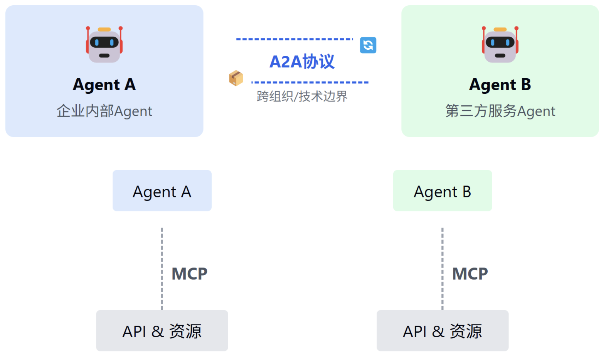

# MCP & A2A

MCP 协议旨在连接大模型与外部工具，解决模型与现实世界的割裂问题，它提供标准化接口，简化大模型对工具的调用过程，类似 USB 标准

A to A 协议关注智能体之间的交互，让不同的智能体（Agent）能够无障碍地沟通和协作，解决 Agent 与 Agent 之间如何发现、通信和协作

- [MCP&A2A协议](./01-MCP&A2A协议.md)
  - [MCP 协议](./01-MCP&A2A协议.md#mcp-协议)
  - [A2A 协议](./01-MCP&A2A协议.md#a2a-协议)
- [协议基础实践](./02-协议基础实践.md)
- [MCP深入](./03-MCP深入.md)
- [A2A深入](./04-A2A深入.md)
- [综合应用](./05-综合应用.md)
